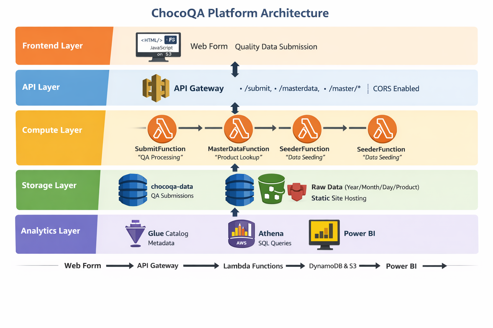

# Chocolate Factory QA Post-Add Platform (MVP)

A portfolio project demonstrating an end-to-end data pipeline for manufacturing QA in a fictitious company, **The Chocolate Factory**.  
The system captures batch QA measurements and post-add adjustments, enriches them with product master data (SKU/WPG/specs), stores transactions for traceability, lands raw events in an S3 data lake, enables SQL analytics in Athena, and visualizes KPIs in Power BI.

## MVP (Minimum Viable Product):** This repository represents a functional first release
 that delivers core QA ingestion, validation, and analytics capabilities, with additional
 enhancements planned in future phases.

## Why this project
Manufacturers rely on controlled specifications, traceability, and continuous improvement. This project simulates a real QA workflow and shows modern data engineering + analytics patterns using AWS.

---

## MVP Architecture
**Web Form (S3)** → **API Gateway** → **Lambda (validate/enrich)** →  
**DynamoDB (master + submissions)** + **S3 (raw data lake)** →  
**Athena (SQL)** → **Power BI (dashboards)**

### Architecture Diagram

🔐 **Security & Observability:**  
See [docs/security.md](docs/security.md) for details on API protection, logging, and planned controls.

---
## Key Features (MVP)
- Product master data (fictitious SKU, WPG, spec ranges) served via API
- QA intake web form populated from master data
- Serverless ingestion with validation + enrichment
- Transaction storage in DynamoDB for batch traceability
- Raw event landing zone in S3 with partitioned folder structure
- Athena SQL queries for KPI calculations
- Power BI dashboard for quality insights (FAIL rate, trends, averages)

---

## Development Sprints (MVP)

This project was delivered iteratively using Agile sprint principles,
focusing on shippable functionality at each phase.

## Sprint 1 – Core Ingestion & Master Data
- Serverless backend deployed using AWS SAM
- Product and ingredient master data modeled in DynamoDB
- QA intake web form integrated with live APIs
- Successful end-to-end data submission

## Sprint 2 – Specification Validation & QA Logic
- Product-level temperature and viscosity specifications added
- Automated in-spec / out-of-spec evaluation (OK / WARN / FAIL)
- Enhanced web form with spec visibility
- Validation logic tested with multiple scenarios

## Sprint 3 – Analytics & Visualization
- Raw QA events landed to S3 (partitioned)
- Athena tables created for analytics
- Power BI connected via Athena ODBC
- KPI dashboards for trends and failure rates

## Sprint 4 – Advanced QA Analytics & Governance (Planned)

**Goal:**  
Extend the MVP with deeper analytics, automation, security, and governance
capabilities to support root-cause analysis and continuous improvement.

**Planned Scope:**
- Ingredient-level impact analysis on viscosity and temperature
- Basic SPC control limits using Athena SQL
- Enhanced Power BI dashboards (control charts, trend alerts)
- Data quality checks and audit enhancements
- Workflow orchestration using Airflow
- SNS notifications when Post-Add submissions are recorded
- AI-assisted QA summaries using Amazon Bedrock
- Submission website authentication using Amazon Cognito

**Status:** Planned

## Tech Stack
- Frontend: HTML/JS static form hosted on S3
- Auth (optional in MVP): Amazon Cognito
- API: Amazon API Gateway
- Compute: AWS Lambda (Node.js)
- Storage: DynamoDB (MasterData + Submissions), S3 (raw data lake)
- Analytics: Athena (+ optional Glue Data Catalog)
- BI: Power BI

---

## Key Outcomes

- Automated QA validation (OK / WARN / FAIL)
- Full batch traceability
- Daily quality trends & failure rate analysis
- Interview-ready demonstration of real manufacturing data workflows

## Data Model (MVP)

The ChocoQA MVP uses a simple but production-aligned data model designed
for traceability, validation, and analytics.

---

## Master Data (DynamoDB: `ChocoQA-MasterData`)

Stores reference data used by the QA intake form and validation logic.

**Product Attributes**
- `productNo` – Fictitious SKU identifier
- `productName` – Product description
- `productType` – Chocolate type (dark, milk, etc.)
- `wpg` – Weight per gallon
- `specTempMin` / `specTempMax` – Temperature limits
- `specViscosityMin` / `specViscosityMax` – Viscosity limits

**Ingredient Attributes**
- `ingredientId`
- `ingredientName`
- `category`
- `defaultUnit`
- `allergens`

---

## QA Transactions (DynamoDB: `ChocoQA-Submissions`)

Stores each QA measurement and post-add action.

- `submissionId`
- `batchId`
- `lineId` / `tankId`
- `timestamp`
- `productNo`
- `temperature`
- `viscosity`
- `specStatus` (`OK` / `WARN` / `FAIL`)
- `postAddIngredient`
- `postAddAmount`
- `s3RawKey` – Pointer to raw event in S3

---

## Analytics Events (S3 → Athena)

Every submission is written as a JSON event to S3 for analytics.

Partitioned by:
- `year`
- `month`
- `day`

These events are queried using Amazon Athena and consumed by Power BI
for KPI reporting and trend analysis.

## Master Data (DynamoDB: `ChocoQA-MasterData`)
Each product includes:
- `productNo`, `productName`, `productType`
- `wpg`
- `specTempMin/Max`, `specViscosityMin/Max`

## Transactions (DynamoDB: `ChocoQA-Submissions`)
Each submission stores:
- batch identifiers (batchId, line/tank, timestamp)
- measured QA values (temp, viscosity)
- post-add action (type, amount)
- computed quality status (`OK/WARN/FAIL`)
- pointer to raw S3 JSON (`s3RawKey`)

---

## S3 Data Lake Layout (MVP)
s3://chocoqa-data/
└── qa-submissions/
└── year=YYYY/
└── month=MM/
└── day=DD/
└── submission-<uuid>.json
