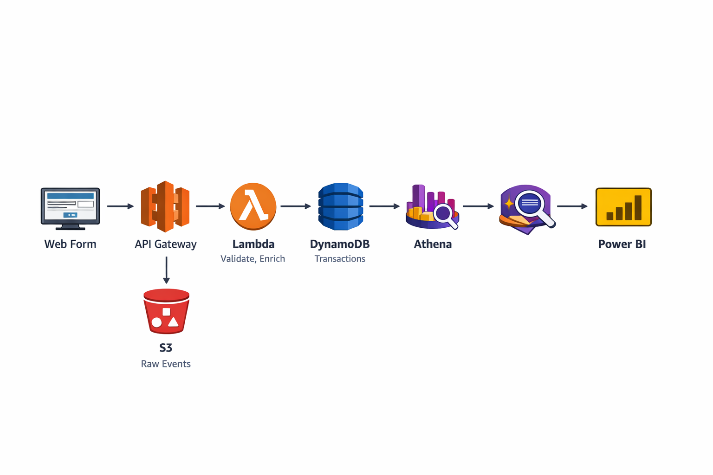
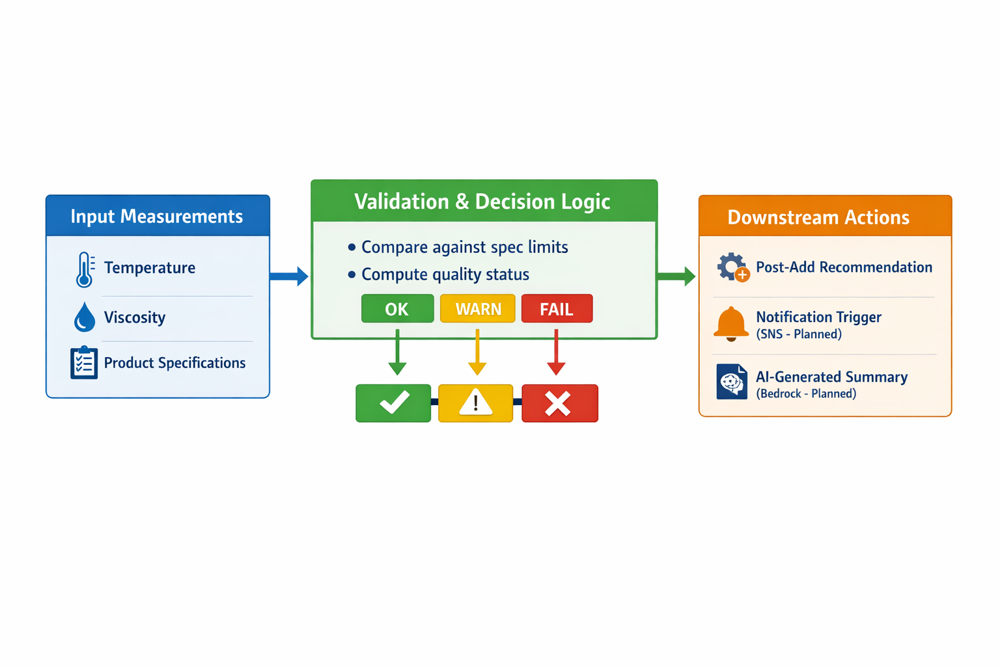
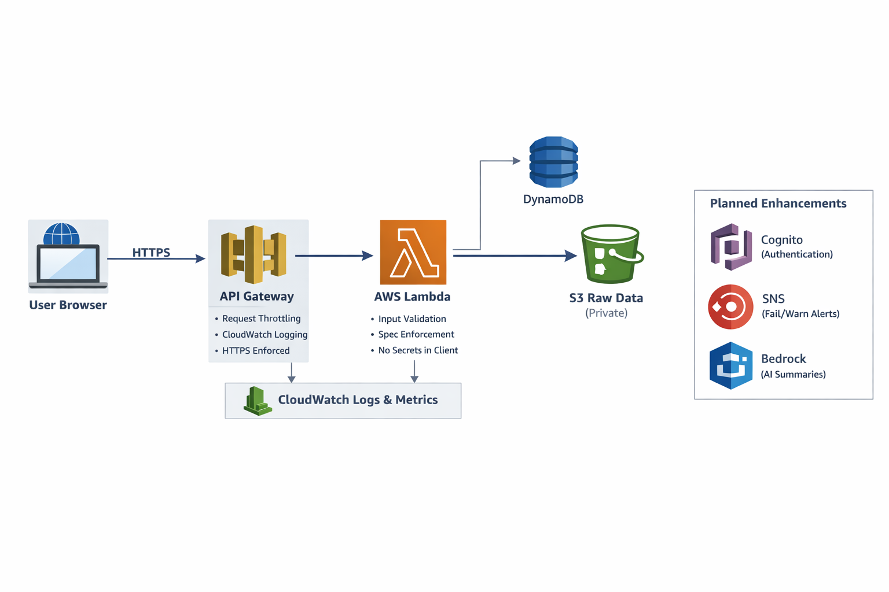

# Chocolate Factory QA Post-Add Platform (MVP)

A portfolio project demonstrating an end-to-end data pipeline for manufacturing QA in a fictitious company, **The Chocolate Factory**.  
The system captures batch QA measurements and post-add adjustments, enriches them with product master data (SKU/WPG/specs), stores transactions for traceability, lands raw events in an S3 data lake, enables SQL analytics in Athena, and visualizes KPIs in Power BI.

## MVP (Minimum Viable Product):** This repository represents a functional first release
 that delivers core QA ingestion, validation, and analytics capabilities, with additional
 enhancements planned in future phases.

## Why this project
Manufacturers rely on controlled specifications, traceability, and continuous improvement. This project simulates a real QA workflow and shows modern data engineering + analytics patterns using AWS.

---

## MVP Architecture
**Web Form (S3)** → **API Gateway** → **Lambda (validate/enrich)** →  
**DynamoDB (master + submissions)** + **S3 (raw data lake)** →  
**Athena (SQL)** → **Power BI (dashboards)**

## Architecture Diagram:**

## System Architecture:**

## Data Flow:**

## QA Validation Logic:**

##🔐 **Security Architecture:**  

---

